# Adult Income 数据集的三角证据分析

# 摘要

本项目将 UCI Adult / Census Income 数据集作为一个“分析问题”而不是纯粹的预测问题来研究。目标是理解：哪些变量能够明显区分两类收入人群，特征之间如何相互依赖，哪些信号在稀疏判别模型中仍然稳健，以及收入分类边界究竟主要是线性的，还是存在有意义的非线性结构。现有实验流程结合了聚焦式探索分析、连续变量的类条件高斯摘要、用于依赖分析的互信息（MI）、L1 正则 Logistic 回归、小规模交互项验证、SVM 核函数比较，以及轻量级稳健性检查。结果表明，连续特征中分离能力最强的是 `education_num`、`age` 和 `hours_per_week`；而 `capital_gain` 和 `capital_loss` 明显非高斯，在高斯视角下仅表现出较弱区分能力。MI 显示 `marital_status`-`relationship` 和 `workclass`-`occupation` 等特征对之间存在较强依赖，但候选数值交互项并没有带来有意义的预测增益。稀疏 Logistic 回归在测试集上达到 `0.897` 的 ROC-AUC，并稳定保留了 `marital_status`、`education_num`、`capital_gain_log1p`、`hours_per_week` 和 `age`。在 SVM 比较中，二次多项式核表现最好（ROC-AUC `0.905`），而线性核和 RBF 核基本持平（分别为 `0.897` 和 `0.896`）。综合来看，这些结果支持这样一个结论：该问题整体上可以被较好解释，只存在有限的低阶非线性；某些强依赖关系反映的是冗余而非有效交互；真正稳健的信号核心比最初完整特征集要小得多。

# 1. 引言

Adult 收入数据集非常适合作为课程项目的数据分析对象，因为它同时包含连续特征和类别特征，存在明显的类别不平衡，并且支持多种互补分析视角。与其只问“哪个分类器预测得更好”，本项目更关注数据本身的结构，以及不同分析方法是否给出一致或互补的结论。

本项目围绕以下四个研究问题展开：

1. 数据的底层分布是什么样的，尤其是连续特征在不同收入类别之间的分布差异如何？
2. 特征之间如何相互依赖，哪些依赖关系提示了可能有意义的交互？
3. 哪些特征携带了真实的预测信号，哪些特征则较弱、冗余或噪声较大？
4. 收入分类边界主要是线性的，还是表现出有意义的非线性结构？

这些问题是相互关联的。某个特征可能在边际分布上看起来能区分类别，但在多变量模型中却是冗余的；某一对强依赖特征也可能只是共享信息，而不是形成有价值的预测交互；非线性核函数可能优于线性模型，即使少量手工构造的交互项并没有起作用。因此，本项目的重点是基于多种证据构建一个连贯的解释框架，而不是依赖单一模型结果。

# 2. 数据集与预处理

原始数据集包含 `48,842` 条记录，使用的是标准 Adult/Census Income 字段。标签为二分类变量 `income_gt_50k`，由原始 `income` 字段是否为 `>50K` 转换得到。

根据项目设计，两个输入特征被移除：

- `education`，因为它与 `education_num` 信息重复
- `fnlwgt`，按照项目规范移除

分析中保留的预测变量为：

- 连续变量：`age`、`education_num`、`capital_gain`、`capital_loss`、`hours_per_week`
- 类别变量：`workclass`、`marital_status`、`occupation`、`relationship`、`race`、`gender`、`native_country`

在建模阶段，`capital_gain` 和 `capital_loss` 还被表示为 `log1p` 变换形式，`native_country` 被折叠为 `native_country_grouped`。

主划分采用分层 80/20 训练测试划分，随机种子为 `42`；稳健性检查使用 `7`、`42` 和 `99` 三个种子。所有调参过程都严格限制在训练集内部完成。

不过，预处理结果中存在一个需要明确说明的细节。`missing_value_summary.csv` 报告的缺失值数量为零，但实际生成的类别汇总结果里，`workclass` 和 `occupation` 等字段中的 `?` 仍然作为一个明确类别出现。因此，本文报告按“已保存输出的实际表现”来描述结果：在至少一部分分析流程中，`?` 更像是被当作了类别而不是空值，而不是被序列化成真正的缺失值。

`native_country` 的处理则更一致。完整数据中，`United-States` 约占 `89.7%`，而折叠后特征与标签的 MI 只有 `0.0006`（见 `native_country_relevance.csv` 与 `feature_label_mi.csv`）。这说明相较于主要的人口统计、家庭结构和工作相关变量，它提供的信号较弱。

# 3. 实验设计

每个实验都直接对应至少一个研究问题。整体实验设计是“三角验证”的：每个阶段都在回答问题的不同侧面，任何单个结果都不会被当作充分证据。

- 聚焦式 EDA 用于建立类别比例、主要描述性差异，以及零膨胀、重复主值等明显分布问题。
- 类条件高斯分析为连续变量提供一个简单的概率视角。这里并不主张数据真实服从高斯分布，而是借此比较均值、方差、重叠程度和单变量判别能力。
- 互信息分析同时衡量特征-特征依赖和特征-标签相关性，并使用第二套离散化方案做轻量敏感性检查。
- L1 Logistic 回归用于回答“信号与噪声”的问题，重点不在某一次拟合的系数，而在于特征组在正则化路径上是否持续存活。
- 交互项验证只测试一小组由 MI 与领域合理性共同筛出的数值交互项，范围是有意受控的。
- 线性、多项式和 RBF SVM 用于检验非线性决策边界是否在实践中真正重要，并将结果与前面的交互分析结合解释。
- 稳健性检查考察结论对随机种子、正则化强度和 MI 离散化方式的敏感程度。

# 4. 结果

## 4.1 聚焦式探索分析

训练集存在明显类别不平衡：`29,724` 条样本（`76.1%`）属于 `<=50K`，`9,349` 条样本（`23.9%`）属于 `>50K`（见 `class_balance_summary.csv` 与 `class_balance.png`）。这意味着仅靠准确率会高估模型效果，因此后续比较更依赖 ROC-AUC 和 F1。

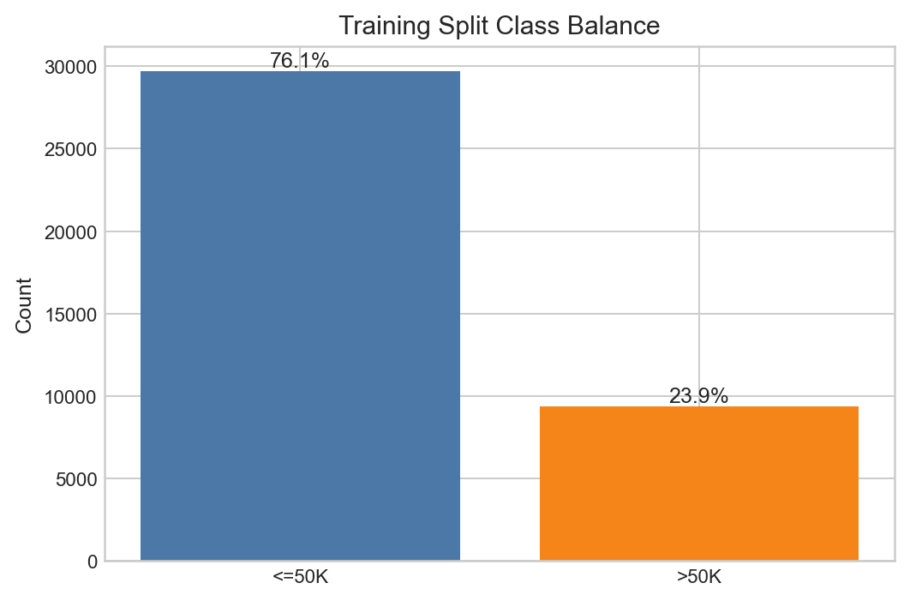

*图1. 训练集中的类别分布。较高收入类别在整个分析中始终是少数类。*

聚焦式 EDA 还揭示了三个会直接影响后续解释的分布现象（见 `continuous_feature_summary.csv`、`continuous_feature_flags.csv` 与 `continuous_by_income_grid.png`）：

- `capital_gain` 极其稀疏，训练集中有 `91.8%` 为 0。
- `capital_loss` 更加稀疏，训练集中有 `95.2%` 为 0。
- `hours_per_week` 存在显著主值，训练集有 `46.5%` 的样本集中在同一取值。

这些发现并非表面现象。它们解释了为什么均值和方差对 `education_num` 和 `age` 更有解释力，而对资本相关变量则较弱，同时也为后续使用 `log1p` 变换提供了理由。

类别变量汇总也已经显示出若干与收入标签关系紧密的模式（见 `categorical_frequency_summary.csv` 与 `categorical_frequency_grid.png`）：

- `Married-civ-spouse` 的高收入比例为 `44.8%`，而 `Never-married` 仅为 `4.4%`。
- `Husband` 和 `Wife` 的高收入比例分别为 `45.0%` 和 `47.5%`，而 `Own-child` 仅为 `1.6%`。
- `Male` 的高收入比例为 `30.4%`，而 `Female` 为 `10.9%`。
- `Self-emp-inc` 的高收入比例达到 `54.9%`，明显高于 `Private` 的 `21.8%`。
- `Exec-managerial` 和 `Prof-specialty` 的高收入比例分别为 `48.2%` 和 `44.6%`，而 `Other-service` 仅为 `4.0%`。

因此，这一阶段的主要作用是确定哪些变量值得在后续重点关注，以及哪些变量存在需要谨慎处理的分布形状问题。

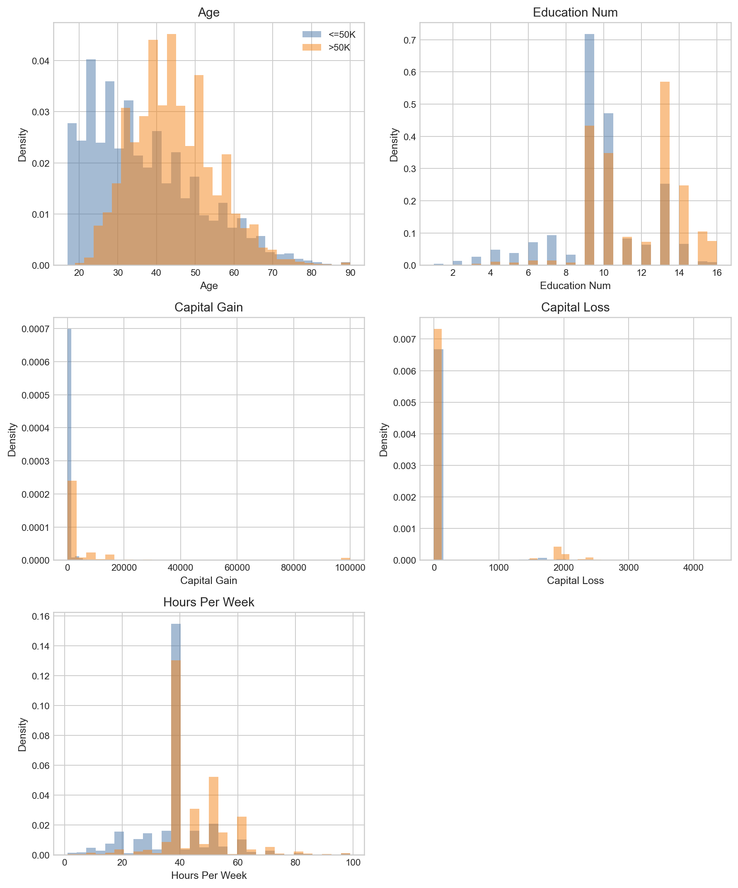

*图2. 连续特征在不同收入类别下的分布对比。`education_num`、`age` 和 `hours_per_week` 有明显位移，而 `capital_gain` 与 `capital_loss` 主要体现为大量零值与长右尾。*

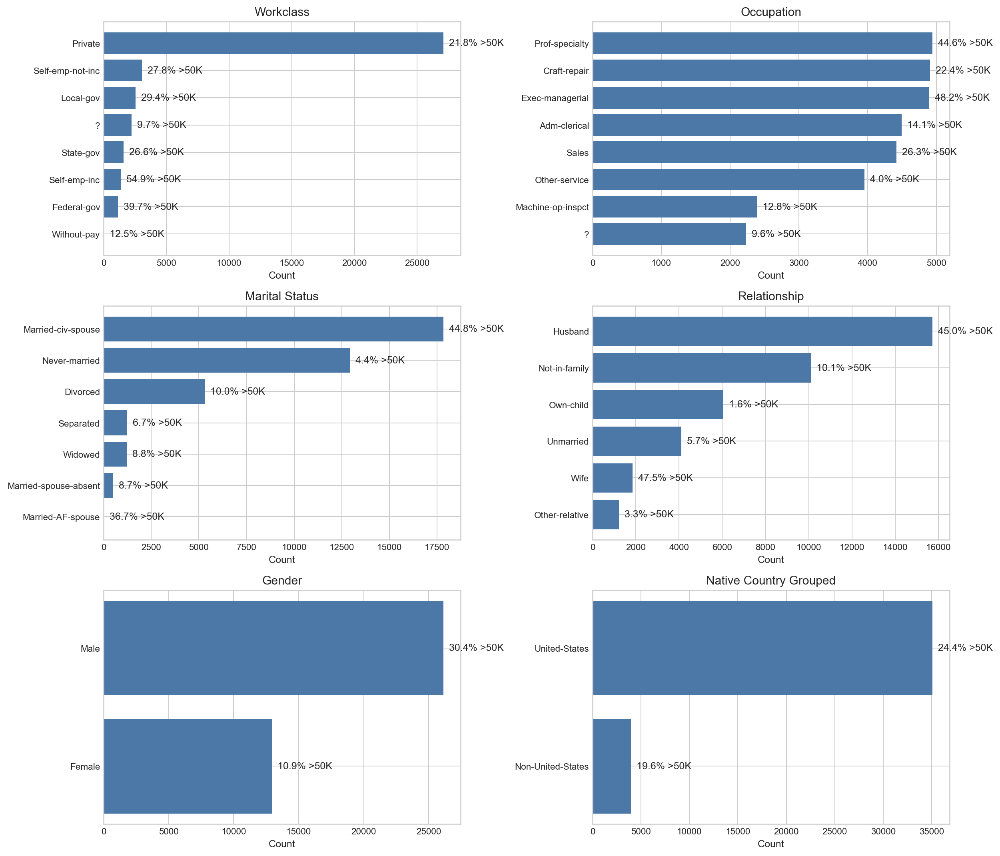

*图3. 选定类别变量的分布及其高收入比例。家庭结构与职业相关变量在正式建模前就已经显示出明显差异。*

## 4.2 类条件分布分析

高斯摘要按单变量 ROC-AUC 和分布重叠程度对连续特征进行排序（见 `gaussian_fit_summary.csv`、`ranked_continuous_features.csv`、`gaussian_fit_overlays.png` 与 `continuous_separation_ranking.png`）。

| 特征 | `<=50K` 均值 | `>50K` 均值 | 单变量 ROC-AUC | Cohen's d | 解释 |
| --- | --- | --- | --- | --- | --- |
| `education_num` | 9.600 | 11.603 | 0.716 | 0.825 | 区分能力最强的连续特征 |
| `age` | 36.919 | 44.350 | 0.682 | 0.556 | 有中等分离能力，但仍有明显重叠 |
| `hours_per_week` | 38.892 | 45.434 | 0.671 | 0.541 | 中等分离，但两类样本都集中在 40 小时附近 |
| `capital_gain` | 147.696 | 3949.978 | 0.588 | 0.532 | 高度偏态且零膨胀，在高斯视角下较弱 |
| `capital_loss` | 55.346 | 199.978 | 0.535 | 0.358 | 高度偏态，在高斯视角下较弱 |

这里有三个最重要的模式。

第一，`education_num` 是最强的连续区分变量，而且优势比较明显。其类别中位数也存在清楚差异（在 `continuous_feature_summary.csv` 中分别为 `9` 和 `12`），说明它的作用不只是均值差异。

第二，`age` 和 `hours_per_week` 具有有意义但并不“干净”的分离能力。高收入类的均值更高，但两类之间仍有较大重叠；尤其是每周工作时长，两类的中位数都仍为 `40`。

第三，资本变量与其他连续变量表现完全不同。两类在 `capital_gain` 和 `capital_loss` 上的中位数都为 `0`，但高收入类均值显著更大。这正符合“极少数大值主导均值”的模式。高斯分析正确地将其标记为非高斯。它们在该视角下分离较弱，但这并不意味着它们整体上没有用，只说明高斯摘要并不适合描述它们的真实形状。

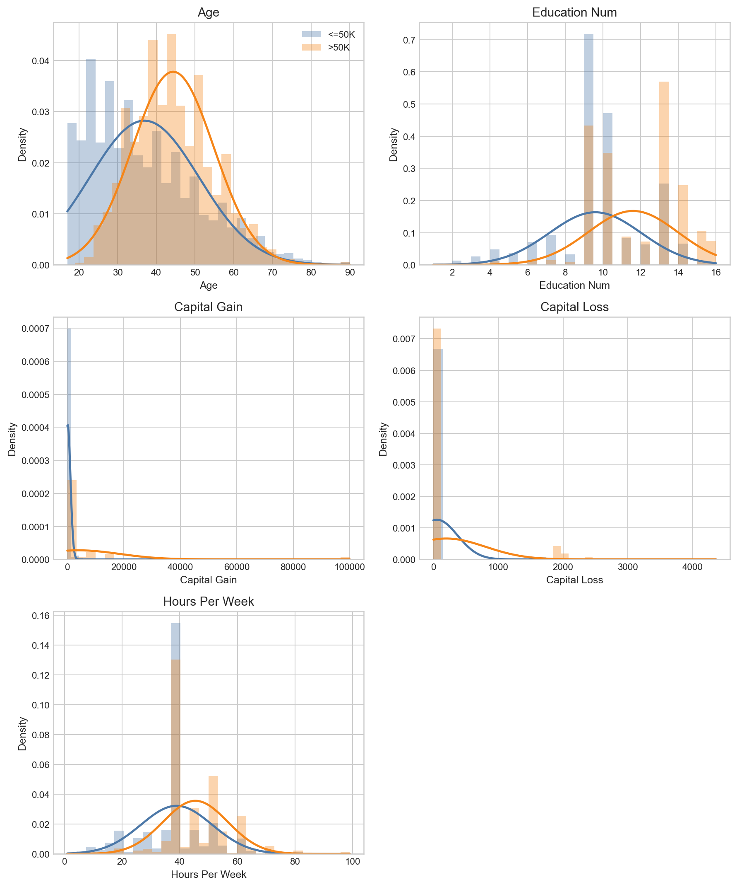

*图4. 经验直方图与类条件高斯曲线的对比。对 `education_num`、`age` 与 `hours_per_week`，高斯视角较为有帮助；对资本变量则明显不够贴切。*

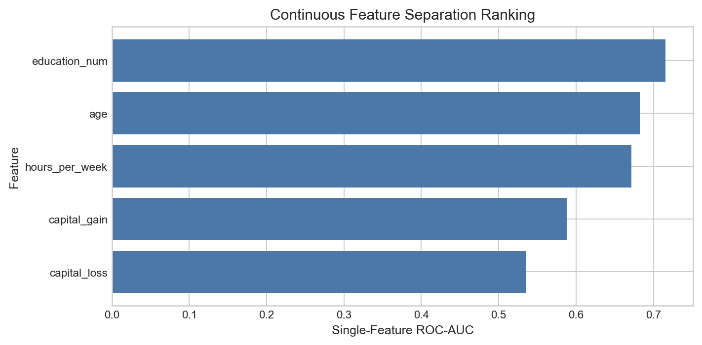

*图5. 按单变量 ROC-AUC 排序的连续特征。`education_num` 是最强的边际连续区分变量。*

## 4.3 特征依赖分析

MI 分析明确区分了两个常被混淆的概念：特征之间的依赖，以及特征对标签的直接相关性（见 `feature_label_mi.csv`、`top_feature_pairs.csv`、`mi_heatmap.png` 与 `top_mi_pairs.png`）。

与标签 MI 最高的特征如下：

| 特征 | 特征-标签 MI |
| --- | --- |
| `relationship` | 0.116 |
| `marital_status` | 0.111 |
| `age` | 0.064 |
| `occupation` | 0.063 |
| `education_num` | 0.062 |
| `capital_gain` | 0.054 |

最强的特征对依赖如下：

| 特征对 | Pairwise MI |
| --- | --- |
| `marital_status` x `relationship` | 0.725 |
| `workclass` x `occupation` | 0.329 |
| `relationship` x `gender` | 0.270 |
| `age` x `marital_status` | 0.233 |
| `education_num` x `occupation` | 0.213 |

这些高 MI 特征对是有信息量的，但它们不应该被直接等同为“交互候选项”。例如，`marital_status` 和 `relationship` 在语义上都反映家庭结构，因此非常高的 MI 更可能表示信息重叠，而不是一个有价值的乘性交互。`workclass` 和 `occupation` 也有类似情况，只是表现形式不同。

保存下来的候选交互项因此主要聚焦在数值变量之间：

- `age` x `hours_per_week`
- `age` x `education_num`
- `education_num` x `hours_per_week`
- `education_num` x `capital_gain`
- `capital_gain` x `hours_per_week`

离散化敏感性检查结果非常稳定（见 `mi_sensitivity_summary.csv`）：两套方案下 top-10 MI 特征对重合度为 `10 / 10`，候选交互项集合重合度为 `5 / 5`。在本项目采用的轻量敏感性范围内，这说明依赖排序结论相当稳固。

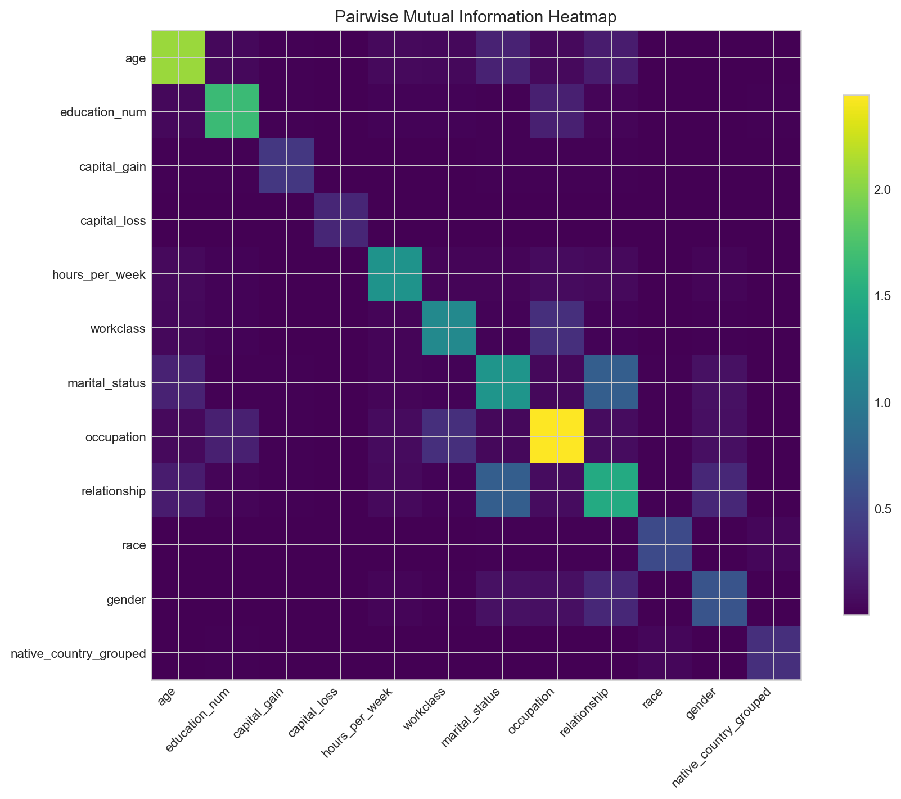

*图6. 保留分析特征之间的 MI 热力图。最强依赖主要集中在家庭结构和工作背景相关变量之间，而非数值交互候选项之间。*

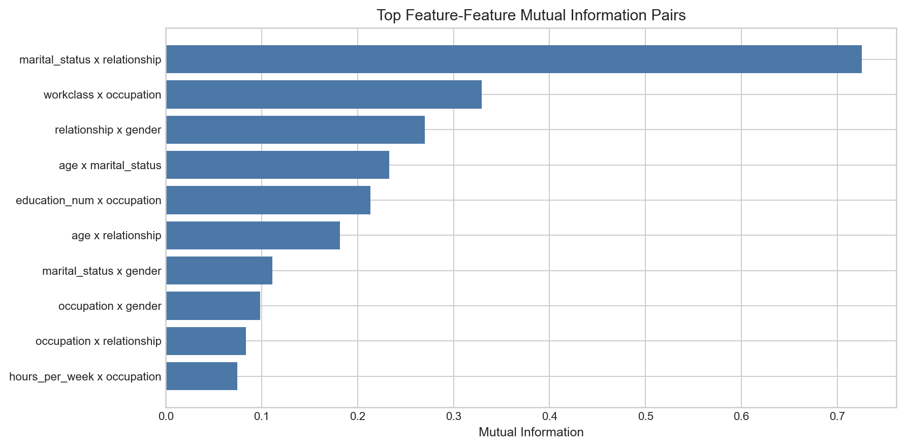

*图7. 互信息最高的特征对。强依赖关系确实存在，但后续结果表明“强依赖”并不自动等于“值得加入预测交互项”。*

## 4.4 稀疏 Logistic 回归中的信号与噪声

L1 Logistic 回归结果回答了两个问题：一个稀疏线性模型能达到怎样的效果，以及哪些特征组在正则化变化下仍然稳定存活（见 `logistic_cv_summary.csv`、`logistic_baseline_metrics.csv`、`stable_features_summary.csv` 与 `logistic_coefficient_paths.png`）。

基线测试集指标如下：

| Accuracy | Precision | Recall | F1 | ROC-AUC | 最优 `C` |
| --- | --- | --- | --- | --- | --- |
| 0.848 | 0.723 | 0.589 | 0.649 | 0.897 | 1.0 |

交叉验证 ROC-AUC 从最强正则化下（`C = 0.001`）的 `0.887` 上升到 `C >= 0.1` 时的约 `0.900` 平台区，而 `C = 0.1` 到 `C = 10` 之间的差异仅出现在小数点后第四位。这说明一旦允许中等程度稀疏性，整体预测故事对具体正则强度并不敏感。

在完整 `C` 网格上最稳定的特征组是：

| 特征组 | 在正则路径上的非零比例 | 平均绝对组系数 |
| --- | --- | --- |
| `marital_status` | 1.000 | 3.359 |
| `education_num` | 1.000 | 0.741 |
| `capital_gain_log1p` | 1.000 | 0.475 |
| `hours_per_week` | 1.000 | 0.328 |
| `age` | 1.000 | 0.317 |
| `capital_loss_log1p` | 1.000 | 0.220 |

另外一些特征组也较稳定，但并非在所有网格点上都保留：

- `occupation`：`88.9%`
- `relationship`、`workclass`、`gender`：各为 `77.8%`
- `native_country_grouped`、`race`：各为 `66.7%`

这一阶段支持三个实质性结论。

第一，最强的稳健信号并不分散。`marital_status`、`education_num`、`age`、工作强度变量和资本相关变量构成了最清晰的信号核心。

第二，一些在高斯视角下看起来较弱的变量，在经过变换后仍然在多变量模型中发挥作用。特别是 `capital_gain_log1p` 和 `capital_loss_log1p` 在整个正则路径中都存活，尽管原始变量的高斯拟合很差。这正说明“分布分析”和“预测分析”回答的是不同问题。

第三，高 MI 并不保证在考虑冗余后仍然稳定。`relationship` 的特征-标签 MI 最高，但在 Logistic 正则路径中，`marital_status` 作为特征组更稳定。这说明二者共享大量信息，而稀疏模型在被迫简化时更偏向使用其中一种表示。

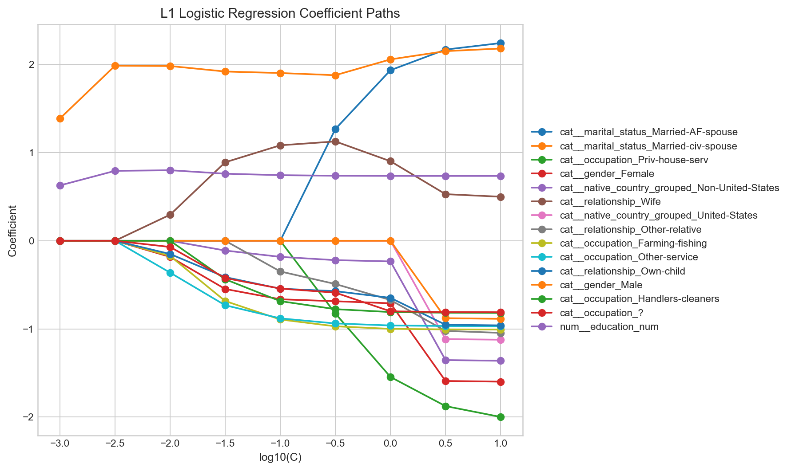

*图8. L1 正则路径下的系数变化。少数特征组在几乎整个路径中都保持活跃，支持“稳健核心信号”这一解释。*

## 4.5 交互项验证

交互阶段检验的是：一小组有针对性的数值交互项，是否能在主效应 Logistic 模型之外提供额外收益（见 `tested_interactions.csv`、`interaction_evidence_table.csv` 与 `interaction_delta_cv_auc.png`）。

| 交互项 | Pairwise MI | CV ROC-AUC 变化 | 测试集 ROC-AUC 变化 | 证据代码 |
| --- | --- | --- | --- | --- |
| `age` x `hours_per_week` | 0.0657 | +0.000174 | +0.000210 | unstable |
| `age` x `education_num` | 0.0517 | -0.000026 | -0.000012 | unstable |
| `education_num` x `hours_per_week` | 0.0265 | -0.000043 | -0.000003 | unstable |
| `education_num` x `capital_gain` | 0.0160 | -0.000025 | +0.000057 | unstable |
| `capital_gain` x `hours_per_week` | 0.0077 | +0.000042 | -0.000066 | unstable |

这里有两个决定性的事实。

第一，预测增益极小。即使最大正向变化，交叉验证 ROC-AUC 也只有 `+0.000174`，测试集最大正向变化也只有 `+0.000210`。这不足以支持“存在有意义提升”的结论。

第二，没有任何交互项通过筛选并形成最终增强模型。这也是为什么 `interaction_model_metrics.csv` 中的 `interaction_augmented` 一行是 `NaN`，而不是一个已拟合的最终模型结果。

因此，这一阶段支持一个克制的结论：依赖分析确实筛出了一些看起来合理的候选交互项，但在这一小组可辩护、受控的测试中，它们都没有显示出超越主效应的稳健预测价值。

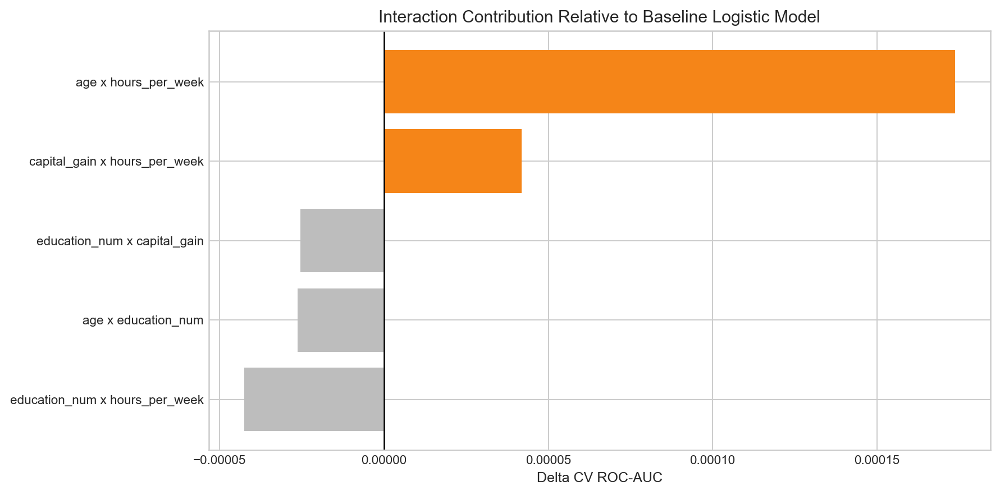

*图9. 加入每个候选交互项后，交叉验证 ROC-AUC 的变化幅度都非常小，这也是最终没有保留交互增强模型的原因。*

## 4.6 基于 SVM 的决策边界分析

SVM 比较是判断边界形状的主要证据（见 `svm_tuning_summary.csv`、`svm_comparison.csv`、`svm_kernel_comparison.png` 与 `final_model_comparison_table.csv`）。

| 模型族 | 最优调参设置 | CV ROC-AUC | 测试集 ROC-AUC | 测试集 F1 |
| --- | --- | --- | --- | --- |
| 线性 SVM | `C = 0.1` | 0.893 | 0.897 | 0.644 |
| 多项式 SVM | `degree = 2`, `C = 1.0`, `coef0 = 1.0` | 0.898 | 0.905 | 0.670 |
| RBF SVM | `C = 3.0`, `gamma = 0.05` | 0.892 | 0.896 | 0.670 |

这里最重要的不是“哪个模型赢了”，而是“这种胜负结构意味着什么”。

- 多项式核在测试集上的 ROC-AUC 比线性核高约 `0.0078`（`0.905` 对 `0.897`）。
- RBF 核并没有优于线性核，反而略低（`0.896`）。
- 在多项式核内部，最优配置是二次模型；保存下来的三次模型在交叉验证中明显更差（`0.883` 和 `0.883`），低于最佳二次配置的 `0.898`。

综合来看，这一模式说明数据中存在有限的低阶非线性，而不是强烈的、普遍的高复杂度非线性。也就是说，纯线性边界并不能完整解释问题，但也没有证据表明必须依赖高度灵活的核函数。

这一点与前面的交互项结果也形成了有层次的呼应。多项式核的提升说明确实存在某些低阶非线性结构，但手工挑选的少量数值乘积项并没有帮助。更合理的解释不是二者矛盾，而是：多项式核可能在整个编码后的特征空间中捕捉到了更广泛的低阶效应，包括平方项和更分散的交互；而显式交互阶段只测试了五个数值乘积项。

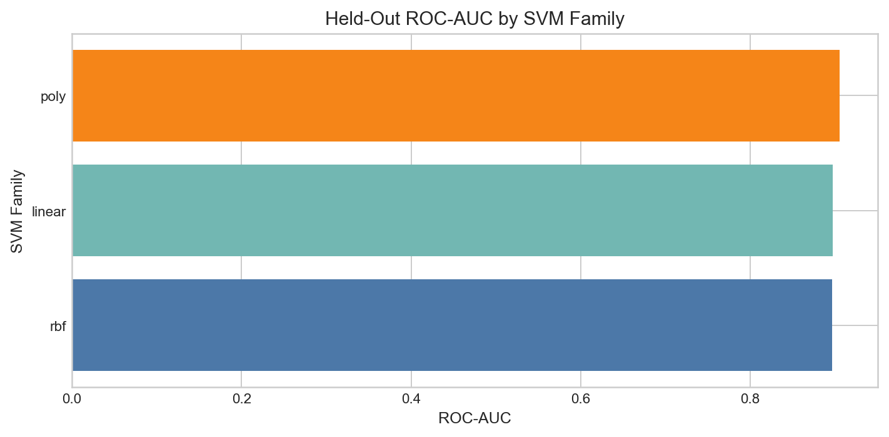

*图10. 不同 SVM 模型族在测试集上的 ROC-AUC。多项式核表现最好，而 RBF 并没有优于线性基线。*

## 4.7 稳健性检查

稳健性部分综合了三类稳定性证据：正则化稳定性、MI 离散化稳定性，以及划分随机种子稳定性。

### 正则化稳定性

Logistic 的 CV 曲线在 `C >= 0.1` 后非常平坦（见 `logistic_cv_summary.csv`）：

- `C = 0.1`：平均 CV ROC-AUC `0.899822`
- `C = 0.3162`：平均 CV ROC-AUC `0.900060`
- `C = 1.0`：平均 CV ROC-AUC `0.900099`
- `C = 10.0`：平均 CV ROC-AUC `0.900054`

这说明 Logistic 的整体结论并不依赖某一个非常特殊的正则化强度。

### MI 离散化稳定性

保存的 `mi_sensitivity_summary.csv` 表显示：两套离散化方案下，top-10 特征对完全重合，候选交互项集合也完全重合：

- Top-10 特征对重合度：`10 / 10`
- 候选交互项重合度：`5 / 5`

因此，依赖结构结论是本项目中最稳定的一部分。

### 随机种子稳定性

不同种子下测试集 ROC-AUC 如下：

| 模型 | Seed 7 | Seed 42 | Seed 99 | 范围 |
| --- | --- | --- | --- | --- |
| L1 Logistic | 0.901 | 0.897 | 0.901 | 0.897 到 0.901 |
| 线性 SVM | 0.900 | 0.897 | 0.901 | 0.897 到 0.901 |
| 多项式 SVM | 0.906 | 0.905 | 0.906 | 0.905 到 0.906 |

多项式核在所有保存的种子上都优于线性核：

- Seed `7`：+`0.0063`
- Seed `42`：+`0.0078`
- Seed `99`：+`0.0045`

这支持了边界形状结论的方向稳定性。与此同时，当前保存下来的稳健性表格（`robust_feature_group_frequency.csv`、`robustness_boundary_consistency.csv`、`robustness_mi_overlap.csv`）也表明，精确的特征重要性排序并不是最稳定的部分，总体性能模式和高层结论才是更稳固的。因此，本项目可以合理声称“主要结论稳定”，但不应声称“每个特征组的精确排序都完全稳定”。

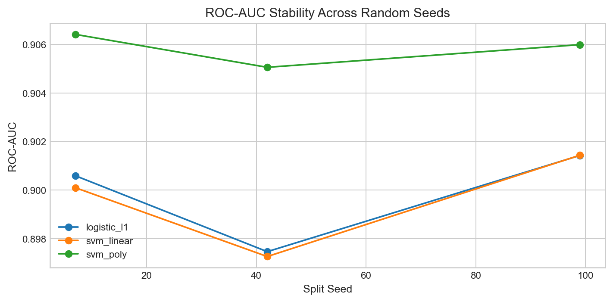

*图11. 关键模型在不同随机种子下的 ROC-AUC 稳定性。多项式 SVM 始终优于线性 SVM。*

# 5. 讨论

本项目的主要价值并不在于某一张单独的指标表，而在于不同方法如何共同收缩解释空间。

最强的一致性出现在 `education_num`、`age`、`hours_per_week` 以及家庭结构变量上。`education_num` 在高斯摘要中是最强的连续区分变量，同时具有较高的特征-标签 MI，并在 Logistic 正则路径中稳定存活。`age` 和 `hours_per_week` 也呈现出类似模式，只是重叠更明显。`marital_status` 与 `relationship` 则主导了类别依赖结构，而在稀疏模型中，至少其中一个始终是核心信号。

最有价值的“方法间差异”体现在资本变量上。高斯分析下，`capital_gain` 和 `capital_loss` 由于零值占绝对多数而表现出很差的拟合和较弱的边际区分能力；但在稀疏 Logistic 模型中，经过变换后的资本变量却贯穿了整个正则路径。这表明：一个特征即使不适合用简单概率分布描述，仍然可能在变换后成为真实预测信号。

依赖分析在与后续阶段对照时也变得更有解释力。`marital_status`-`relationship` 和 `workclass`-`occupation` 是强 MI 特征对，但这并不意味着必须加入显式交互项。事实上，数值交互项测试几乎没有任何提升。这说明强依赖关系很多时候反映的是共享背景信息或冗余，而不是可直接转化为增益的乘性结构。

SVM 结果则帮助明确“线性还是非线性”这一问题。线性模型本身已经很有竞争力：稀疏 Logistic 和线性 SVM 的测试集 ROC-AUC 都在 `0.897` 左右。这排除了“必须依赖高度复杂的非线性模型”的说法。但二次多项式 SVM 又稳定优于线性和 RBF，这说明“完全线性”也不是最合适的描述。最合理的结论是：存在一定低阶非线性，但不是强烈的高复杂度非线性。

不同方法在特征重要性的排序上也存在有意义的不一致。`relationship` 的 MI 最高，但 `marital_status` 在 Logistic 正则路径中更稳定。这并不构成冲突，而更像是重叠信息的不同呈现方式：二者都编码了家庭结构，而稀疏判别模型会更偏向其中一个更高效的表示。

总体而言，这套三角证据框架达到了预期目标。概率视角、MI 分析、稀疏线性模型、显式交互验证和核方法比较虽然并不输出完全相同的信息，但它们共同构成了比单一方法更可信、更收敛的结论。

# 6. 对研究问题的最终回答

## 1. 数据的底层分布是什么样的，尤其是连续特征在不同收入类别之间的分布差异如何？

连续特征的表现并不一致。`education_num`、`age` 和 `hours_per_week` 在高收入类别上整体偏高，表现出最明显的类别分离。`capital_gain` 和 `capital_loss` 则由大量零值和长右尾主导，因此明显非高斯，在简单边际高斯分析下只有较弱分离能力。类别变量方面，`marital_status`、`relationship`、`occupation` 和 `gender` 也表现出明显类别差异。

## 2. 特征之间如何相互依赖，哪些依赖关系提示了可能有意义的交互？

特征之间确实存在较强依赖，尤其是 `marital_status`-`relationship`、`workclass`-`occupation` 和 `relationship`-`gender`。这些依赖关系在两套保存下来的离散化方案中都非常稳定。但后续交互项验证显示，筛出的数值交互项并没有带来有意义的预测提升。因此，最稳妥的结论是：数据中存在真实依赖结构，但大多数依赖并不应该直接解释为“值得加入的预测交互项”。

## 3. 哪些特征携带了真实的预测信号，哪些较弱、冗余或更像噪声？

最强且最稳健的信号来自 `marital_status`、`education_num`、`capital_gain_log1p`、`hours_per_week`、`age` 和 `capital_loss_log1p`，这些特征在完整的 L1 正则路径中都稳定存活。`occupation`、`relationship`、`workclass` 和 `gender` 也有作用，但稳定性略低。`race` 和 `native_country_grouped` 相对较弱。MI 和 L1 的对比还说明，一些家庭结构变量之间存在明显冗余，尤其是 `relationship` 和 `marital_status`。

## 4. 收入决策边界主要是线性的，还是存在有意义的非线性结构？

决策边界并非纯线性，但也不是强烈的、普适的非线性。线性模型已经表现良好，测试集 ROC-AUC 约为 `0.897`。二次多项式 SVM 将其提升到 `0.905`，而 RBF 核并没有超过线性基线。因此，最可辩护的结论是：这个问题包含有限的低阶非线性结构，而不是高复杂度的广义非线性边界。

# 7. 局限性

- 高斯分析本质上是描述性工具。它适合做排序和比较，但对于 `capital_gain` 和 `capital_loss` 这类零膨胀变量并不合适。
- 保存下来的缺失值处理证据存在不一致。预处理规范写明 `?` 应被处理为缺失值，但实际类别输出中它仍然作为类别出现。因此，本报告必须依据“已保存结果”来解释，而不能默认预处理意图被完全执行。
- 交互项阶段是刻意收缩搜索空间的，只测试了五个数值交互，而非所有可能的数值、类别或混合交互。因此“没有发现有用交互”并不等于“整个特征空间中完全不存在有用交互”。
- SVM 比较能够帮助判断边界形状，但核函数表现本身并不能指出究竟是哪一个具体非线性项在起作用。
- 所有结论都具有数据集特异性。它们描述的是 Adult 数据集中的结构，不应被直接外推到其他场景。

# 8. 结论

Adult 收入数据在两类之间存在清晰的描述性差异，但并非所有差异在多变量稀疏建模后都同样重要。`education_num`、`age`、工作强度变量、资本相关变量以及家庭结构变量构成了最强的信号核心。互信息揭示了明显的依赖结构，但这些依赖很少转化为有用的显式交互项。线性模型已经解释了问题的大部分结构，而二次多项式 SVM 的稳定优势则说明存在有限的低阶非线性，而不是强烈的一般非线性复杂度。稳健性检查进一步支持了这些高层结论：主要性能模式和 MI 排名都比较稳定，而更细粒度的特征排序则应更谨慎地解读。
